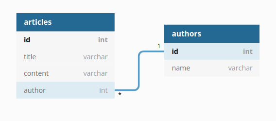

# Junior Technical Test 01

## Prerequisites

To build and run the project you need **Docker** and **Docker Compose**

* **Docker** installation guide https://docs.docker.com/get-docker/ choose your platform and follow the instructions
* **Docker compose** installation guide https://docs.docker.com/compose/install/

## Description

This is a little test to check your abilities working with a framework like **Django** and create a working web application using **PostgreSQL** as storage. 


## Excercises
1. Write 2 models representing an article and an author associated to it, this is an UML representation of the result

 &emsp;&emsp;&emsp;&emsp;

2. Implement the view **/articles** that shows a well written **HTML** page of the list of titles of the current articles stored, each title is a link to the detail of the article
3. Implement the view **/articles/:id** that shows in well written **HTML** page the detail (title, content, author name) of an article.
4. Implement a counter for each article that keeps count of the number of **pageviews**
5. Implement a view **/report** that lists the article titles and **pageviews** number

## Bonus (Optional)
1. Write a REST API **/rest/articles** that returns the json representation of the articles list
2. Write a test using **Django's** test runner of the API
## Duration of the test
&emsp;1 week

## Conclusion
 At the end of the excercises step is expected a document decribing how to run the application and populate the **database** to try out the views implemented.
The pages must be well structured but no extra points are given for the web design, you can use any css framework you know and like 

## Run the django app
Execute 
```
    make up
```
```
    make migrate
```
the command builds and creates a development environment for a django web app that you can test navigating to http://localhost:8000
## Commands

Build the docker image of the django app
```bash
    make build
```

Start the django application and all the services needed
```bash
    make up
```

Open a session in the container terminal
```bash
    make bash
```

